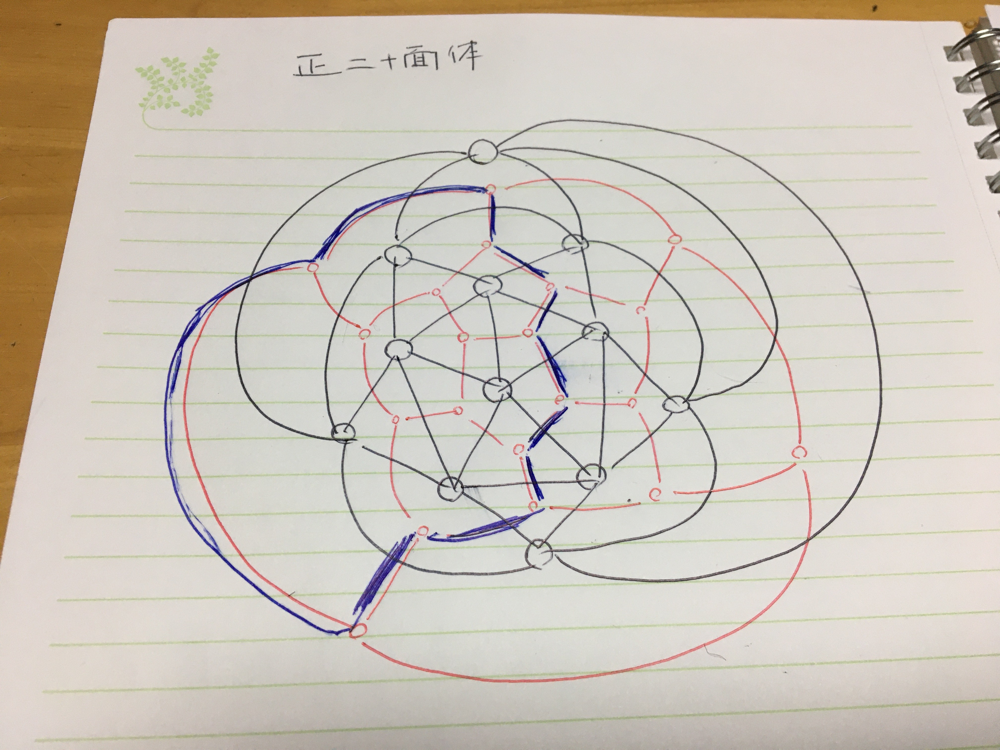
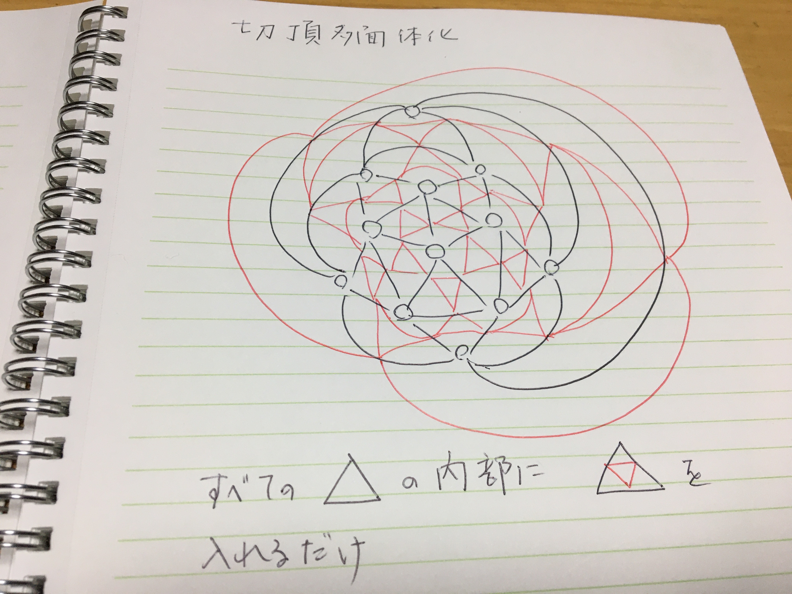
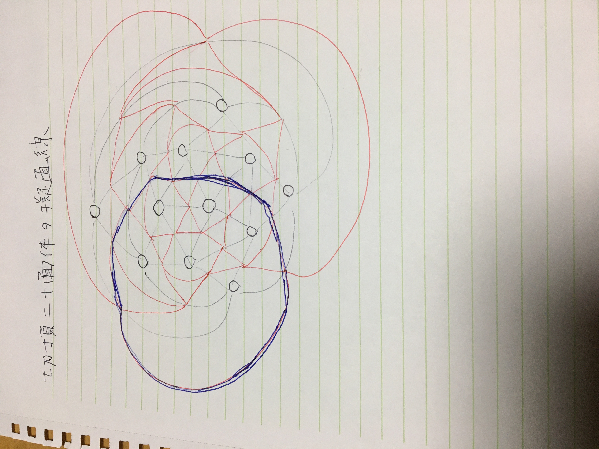
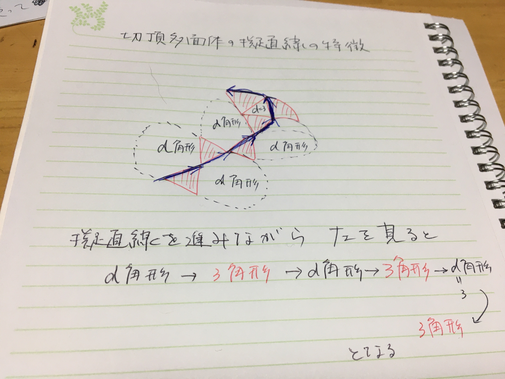

```{r setup, include=FALSE}
library(rgl) 
library(knitr)
library(rsvd) # 低ランク特異値分解用
library(matlib)
library(onion) # 四元数用
library(pracma) # 3dベクトルのcross product計算関数のため

knitr::opts_chunk$set(echo = TRUE)
knit_hooks$set(webgl = hook_webgl)
```

## 正三角形でできた閉多面体と擬直線

### 距離に基づく擬直線

多様体上の直線の定義には、「最短～まっすぐ」という考えに基づいた「最短性擬直線」的な曲線が定義できる。

閉多面体グラフの場合には、グラフのグラフ長重み付き距離に基づいて、離散版の「最短性擬直線」が定められる。

### 局所平面において左右に曲がらないという方針での擬直線

まっすぐ、という意味には、進行し得る方向のど真ん中方向に進む、という意味もある。

この「左右の偏りなし～まっすぐ」という考えに基づいた「方向性擬直線」的な曲線も定義できそうである。

これを滑らかな閉曲面に定義することは、リーマン曲率行列とその接続などを議論する必要がある。

しかしながら、閉曲面のうち、ある特殊な離散化された閉多面体の場合には、「方向性擬直線」が次のように定義できる。

正三角形でできた閉曲面の三角形を頂点とし、三角形の隣接関係を辺としたグラフは、閉多面体グラフであり、すべての面が正多面体である、したがってすべての辺の長さは等しい。また、すべての頂点の次数は３である。

このようなグラフのある辺をある方向に進むと、進行方向に対して右に60度曲がるか、左に60度曲がるかのどちらかになる。

このグラフの各頂点を閉曲面の局所平面近似であると考え、十分に狭い範囲で考えれば、この２者択一進行は、±60度の進行方向変化の十分に良い近似であると考えてもよいだろう(よいとする)。

今、この左右路選択を交互に選ぶことにすると、それは大まかに言って、２歩ごとには「左右の偏りなし～まっすぐ」な進行とみなすことも悪くなさそうである。

これを、正三角形閉多面体(の双対グラフ)の離散版「方向性擬直線」と呼ぶことにする。


## 方向性擬直線の大事な特徴

方向性擬直線には大事な特徴が２つある。

* すべての方向性擬直線は閉路である
* すべての方向性擬直線の辺を数え上げるとすべての辺が２回ずつ通過される

そのほかの性質として

* 方向性擬直線は自己交差することがある
* 方向性擬直線の長さ(歩数)は偶数である



## 切頂多面体における方向性擬直線

方向性擬直線が正三角形閉多面体の双対グラフに定義された。

されにこの方向性擬直線について検討を加えるために、次のようなグラフを導入する。

### 正三角形閉多面体の切頂体

### 正三角形閉多面体の頂点を切り取って、切頂多面体を作る方法

正三角形閉多面体の頂点のすべてを平面で切り取ることにする。

頂点を切るので、そのようにしてできる多面体を切頂多面体と言う。

頂点を切り取るにあたり、オリジナルの多面体の辺の中点を通るように切ることにする。


これを、切頂多面体とこの後は簡略化して呼ぶことにする。

### 切頂多面体の特徴

この処理により、オリジナルの正三角形正多面体のすべての面からは、その中央に、面積が1/4の正三角形が構成される。

また、オリジナルの正三角形正多面体のすべての頂点からは、その頂点の次数がdであったときには、正d角形が構成される。


オリジナルの正三角形からできた小さな正三角形同士は、頂点でつながりうるが、辺を共有することがない。

また、オリジナルの頂点からできた頂点次数正d角形同士も、頂点でつながりうるが、辺を共有することがない。


オリジナルの正三角形閉多面体の頂点数、辺数、面数が、k+2,3k,2kであったとすると、
* 切頂多面体の頂点数は3k(オリジナルのエッジの本数)
* 辺数は6k(オリジナルの三角形の数の3倍)
* 面数は3k + 2 = (k+2) + 2k (オリジナルの頂点の数と三角形の数の和)

そのほかにも特徴がある。

* すべての頂点の次数は4である
* すべての辺は、disjointな３辺トリオに分けることができる
* すべての辺は、disjointな頂点次数正d角形の辺の部分集合に分けることができる
* disjointな辺の部分集合への分解は、切頂多面体グラフのエッジに頂点周り辺が時計和回りになるように向きを付ければ、頂点周り正d多角形はそのグラフの時計周りdisjointサイクル集合を作り、同時に、反時計回り正三角形disjointサイクル集合を作る

このように正三角形を作ったり、頂点周り正d角形を作ったりするように、辺に向きを付けると、次数が4の頂点に、ある１つの辺で入ってきたときに、２通りの道の取り方があって、それが時計回りであるときは頂点周り正d角形の一部をなし、反時計回りであるときは、正三角形の一部をなす。そして、辺の向きがぶつかってしまうことで進めない、もう１本の辺が、その頂点には入り込んでくる。

この入り込んでくる辺は、時計回り辺と反時計回り辺との間にある。

辺に向きを付けてしまうと、この真ん中の道を進むことはできないが、再び、辺の向きを取り除いてしまえば、真ん中の道を進むことができる。

この「真ん中の道」を進み続けたものが、正三角形閉多面体の双対グラフに定義した「方向性擬直線」とほぼ同じものになることが確かめられる。

切頂多面体擬直線と呼ぶことにする。






この切頂多面体擬直線の特徴には以下がある。

* サイクルである
* 長さは偶数である
* すべての辺は１度だけ通過される(これが双対グラフの方向性擬直線と異なる性質)
* 言い換えると、disjointなサイクルに分けられる

さらに、切頂多面体擬直線の有望な特徴としては次のよう点がある。

6k本の辺が、３つの方法でdisjoint setsに分けられた。

* 局所正三角形と言いうサイクル(オリジナルの正三角形に対応)
* 局所頂点次数正d角形というサイクル(オリジナルの頂点次数～局所曲率～に対応)
* 閉多面体上を大きく動き回るサイクル

このように切頂多面体擬直線は閉多面体の大域的な情報を保有している予感がする。


## 切頂多面体擬直線の周辺構造

説明を簡単にするために、切頂多面体の辺に再び向きを入れよう。

ある辺をその向き沿って進み、ある頂点に入ってきたとする。

4次正則グラフなので、入ってきた辺以外に３つの辺がその頂点には接続している。

時計回りに回ると、頂点周り正d角形を作る選択となり、反時計回りに回ると、正三角形を作る選択となる。

擬直線を作るには、その中央の道を選ぶことになる。

頂点を２本の直線の交点とみなせば、交叉点をまっすぐ進むことと同じである。


今、最初の辺の進みを、ある正三角形を左に見ながら、その正三角形の1辺と通ったとみなせば、次の辺は、頂点周り正d角形を左に見ながら1辺を進むことになる。

次の１歩は、左に正三角形を見ていて、次の１歩は左に正d角形・・・

このように、3,d,3,d,3,d角形を左に見ながらの折れ線が擬直線である。

## 方向性擬直線の作図

そのような擬直線を作図してみよう。

### 初期状態

初期状態は、単位正三角形(１辺の長さが１の正三角形)の３頂点と、2辺(第１頂点→第２頂点、第２頂点→第３頂点)からスタートする。

### 正d角形を連結する

#### 正d角形の大きさ

追加前の折れ線の末尾の3点V1,V2,V3の情報を使って、それに、正d角形を追加する。

正d角形を追加するにあたり、まず、その正d角形の中心座標をランダムに作成する。

追加される正d角形は、辺 V2-V3を共有するはずである。

１辺の長さが1である正d角形が内接する円の半径$r_d$は、

$$
\sin{\frac{\pi}{d}} = \frac{\frac{1}{2}}{r_d}
$$
である。

このような中心は、辺V2-V3の中点から、距離$l_d$の点のいずれかである。

ただし
$$
l_d^2 + (\frac{1}{2})^2 = r_d^2
$$

### 正d角形の中心座標

#### 中心座標のある候補を一つ算出する

まず、3点V1,V2,V3を含む平面上にあって、上記を満足する点(のうちV1から遠い方の1点)の座標を算出する。

辺V2-V3の中点からの距離は解っているから、辺V2-V3と直交し、この面上にあるベクトルがわかれば、この座標の算出は可能である。

ある平面上に、２つの相互に一般的な関係にある単位ベクトル $e_1,e_2$があることがわかっているとき、$e_2$に垂直なベクトルは

$$
e_1 - <e_1,e_2> e_2
$$
ただし、$<a,b>$はベクトルa,bの内積であることを利用する。

#### 中心座標の候補をランダムに算出する

辺V2-V3の中点を中心とし、指定距離にある点をランダムに選びたい。

3次元空間の場合、四元数
$$
rot.q(\theta,(q_i,q_j,q_k))=\cos{\theta/2} + \sin{\theta/2} * q_i I + q_j J + q_k K\\
q_i^2 + q_j^2 + q_k^2 = 1
$$
ただし、$I,J,K$は四元数の３つの虚単位は、原点を中心とし、ベクトル$(q_i,q_j,q_k)$を軸に、角度$\theta$の回転を以下のように表すことが知られているので、それを利用する。

ある3次元空間の点$(v_i,v_j,v_k)$を、上記の四元数$rot.q(\theta,(q_i,q_j,q_k))$が指定する回転で移した点の座標は

$$
Conj(rot.q(\theta,(q_i,q_j,q_k))) \times (v_iI+v_jJ+v_kK) \times rot.q(\theta,(q_i,q_j,q_k))
$$

で表される四元数の３つの虚部係数となる。"Conj()"は共役。

したがって、辺V2-V3のベクトル(回線軸)が与えられているから、適当に$\theta$を与えれば、ランダムに正d角形の中心座標が求められる。

### 正d角形の頂点座標の算出

正d角形の頂点座標は、上記で算出した中心座標を中心として、この中心とV2,V3とを乗せた面の法線ベクトルを軸として、点V2を$\frac{2\pi}{d}$ずつ、回転していくことで求まる。

法線ベクトルは、平面上の２つのベクトルのcross-productによって得られるから、正d角形中心とV2,V3とを結ぶ２つのベクトルから求められる。

### 擬直線を構成する頂点の算出

左に正三角形、正d角形、3,d,3,d,...を見ながら一つずつ、正3/d角形頂点を算出し、次の正3/d角形頂点計算のための、３頂点を取り出すことを加えれば、正3/d角形列が算出できる。

擬直線は、１つの正3/d角形を加えたときに、擬直線を構成する１つの頂点を記録することで実現できる。

### Rによる実装


```{r}
# threevs ある２つの接続する線分の３点座標(1行目が第１点)を入力とし
# ２つ目の線分の両端を通り
# ２つの線分を含む面上に中心を持つ
# 円の中心座標を返す関数
# ただし、その円の半径rは指定する

my.circle.ctr3d <- function(threevs,r){
	ctr2 <- apply(threevs[2:3,],2,mean)
	edges <- apply(threevs,2,diff)
	orthov <- edges[1,] - edges[2,] * sum(edges[1,]*edges[2,])
	orthov.st <- orthov/ sqrt(sum(orthov^2))
	len <- sqrt(r^2-(1/2)^2)
	circle.ctr <- ctr2 + orthov.st * len
	return(circle.ctr)
}

# 1辺の長さが1の正d角形の頂点を通る円の半径
my.r.unitpoly <- function(d){
	(1/2)/sin(pi/d)
}

# ３連続点(線分長は１)の第２線分を１辺とする正d角形の中心座標
my.poly.ctr3d <- function(threevs,d){
	r <- my.r.unitpoly(d)
	out <- my.circle.ctr3d(threevs,r)
	return(out)
}
# 正三角形と正di角形とを交互につなごう
# 正三角形の２辺と、正di角形の３エッジが、折れ線を構成する
# 正三角形の１辺と次の正di角形の１辺とは同一辺

# ある長さ１の線分が定まったとき、その対角が2pi/d である点が正d角形の中心
# その中心点候補は、線分の中点を原点に取り直し、
# ある中心候補点を
# その辺を軸としてある角度を回転させた点
# １つの候補点を与える必要があるが、それは、正d多角形の一つ前の正三角形と同じ平面上の点を取ることにする

# 次の多角形は正d角形
# threevsはその手前の正d角形の3頂点座標
# theta は次の正d角形の中心座標を、平面からどのくらい「起こす・仰がす」かの角度
# デフォルトで比較的、小さめの値を与えている
# 次の正d角形の中心座標を返す

my.next.center.d <- function(d,threevs, theta = runif(1)*2*pi/10){
	edge12 <- apply(threevs,2,diff)
	center2 <- apply(threevs[2:3,],2,mean)
	cand <- my.poly.ctr3d(threevs,d)
	cand <- cand - center2
	cand.q <- cand[1] * Hi + cand[2] * Hj + cand[3] * Hk
	
	q <- edge12[2,1] * Hi + edge12[2,2] * Hj + edge12[2,3] * Hk
	rot.q <- cos(theta/2) + sin(theta/2) * q
	rot.v <- Conj(rot.q) * cand.q * rot.q
	
	return(center2 + c(i(rot.v), j(rot.v), k(rot.v)))
}
```


正d角形の中心座標候補点を図示してみる。

```{r,webgl=TRUE}
threevs <- rbind(rep(0,3),c(1,0,0),c(0.5,sqrt(3)/2,0)) + 3
d <- 5
# 次の正d角形の中心候補をいくつ発生させるか
n.ctr <- 100

ccc <- matrix(0,n.ctr,3)
for(i in 1:n.ctr){
	ccc[i,] <- my.next.center.d(d,threevs,theta=runif(1)*2*pi)

}
limlim <- range(c(threevs,ccc))
plot3d(rbind(rep(limlim[1],3),rep(limlim[2],3)))
points3d(rbind(threevs,ccc))
segments3d(threevs[c(1,2,2,3,3,1),])
```

```{r}
# 3次元空間で、正d角形の中心と１辺が与えられたときに、その正多角形の辺(頂点)情報を与える関数
# 正d角形の法線ベクトルは、エッジと中心点とが定める２ベクトルの外積cross-product
# ctrは次の正d角形の中心座標
# twovsはその正d角形が共有するべき１辺の始点V1座標(第１行)と終点V2座標
# dは正d角形のd
# 計算する正d角形の頂点数。デフォルトで、正d角形の全頂点を計算させることにしている
# 返り値は正d角形の頂点座標(V1,V2に引き続き、V3....,Vn.edge)
my.dpoly.ctrd <- function(ctr,twovs,d,n.edge=d){
	v1 <- twovs[1,] - ctr
	v2 <- twovs[2,] - ctr
	crpr <- cross(v1,v2) # クロス積をとって法線ベクトルを作る
	crpr <- crpr/sqrt(sum(crpr^2))

	q.v <- Hi * crpr[1] + Hj * crpr[2] + Hk * crpr[3]
	thetas <- (0:((1)*(n.edge-1))) / d * 2 * pi
	rot.q <- cos(thetas/2) + sin(thetas/2) * q.v
	
	first.q <- Hi * v2[1] + Hj * v2[2] + Hk * v2[3] # 20200110
	vs <- Conj(rot.q) * first.q * rot.q

	ret <- cbind(i(vs)+ctr[1],j(vs)+ctr[2],k(vs)+ctr[3])
	return(ret)
}
```

使ってみる。


先ほど発生させた、多数の候補中心点の一つを中心点として計算して描く。

```{r,webgl=TRUE}
ctr <- ccc[1,]
out <- my.dpoly.ctrd(ctr,threevs[c(2,3),],d=d)
limlim <- range(c(threevs,out))
plot3d(rbind(rep(limlim[1],3),rep(limlim[2],3)))
points3d(threevs)
segments3d(threevs[c(1,2,2,3,3,1),])

next.polygon <- out

points3d(next.polygon)
segments3d(next.polygon[c(t(cbind(1:d,c(2:d,1)))),])
```

正三角形と正d角形を交互に指定してランダムな方向性擬直線とそれを構成する正多角形列座標を計算してみる。


```{r}
# dsは、d1,3,d2,3,d3,3,...という正多角形のdを定めるベクトル
# thetas は正d角形を継ぎ足すときのその面の起き上がり角度ベクトル
# 初期３点はデフォルトで与えてある。辺長１の正三角形なら何でもよい

# 返り値
# vs 必須折れ線の頂点座標列
# dtrs 正多角形中心座標の列
# ctrs=ctrs
# poly.series 正多角形の全頂点情報
# pseudo.line 擬直線頂点座標列
# thetas,es,dsは作成条件

my.serial.poly.line <- function(ds,thetas= runif(length(ds))*2*pi/10,init.vs=rbind(rep(0,3),c(1,0,0),c(1/2,sqrt(3)/2,0))){
  # 擬直線をつないでいくにあたり、4点を連ねていくことになるので、そのためのesオブジェクト
  # ただし、4点というのは、重複辺の点の数を含めて点の数
  es <- rep(4,length(ds))
  # 3点座標から、2辺ベクトルを作る
	edge.series <- apply(init.vs,2,diff)
	# この時点での辺の本数
	tmpne <- length(edge.series[,1])
	# この時点での2辺情報
	two.edges <- edge.series[(tmpne-1):tmpne,]
	# この時点での正多角形の連結に必要な頂点数(3点、4点を加えて行って作る点列)の座標情報(擬直線作成に必須な折れ線の頂点情報)
	v.series <- init.vs
	# この時点での、全多角形頂点座標
	poly.series <- init.vs
	# この時点での、擬直線の座標(まだ１点しかない)
	pseudo.line <- init.vs[2,] # 20200110
	# 連結する正多角形の数
	n <- length(ds)
	# この時点での必須折れ線頂点数
	tmp.nv <- length(v.series[,1])
	# この時点での、末尾３頂点
	threevs <- v.series[(tmp.nv-2):tmp.nv,]
	# 正多角形の中心座標を格納する行列
	ctrs <- matrix(0,n,3)
	for(i in 1:n){
		tmp.nv <- length(v.series[,1])
		threevs <- v.series[(tmp.nv-2):tmp.nv,]
		# 正多角形中心
		ctr <- my.next.center.d(ds[i],threevs,thetas[i])
		ctrs[i,] <- ctr

		# 正d角形の全頂点を計算
		tmp.out <- my.dpoly.ctrd(ctr,threevs[2:3,],d=ds[i])
		# 20200110
		tmp.out2 <- tmp.out
		if(ds[i]==3){ # 3角形連結のときに４点追加するために点を追加
		  tmp.out2 <- tmp.out[c(1,2,3,1),]
		}
		# 必須折れ線の頂点
		new.vs <- tmp.out2[1:(es[i]),]
		# 擬直線に加えるべき点
		new.line <- tmp.out[3,]
		# 多角形全頂点を追加
		poly.series <- rbind(poly.series,tmp.out)
		# 必須折れ線頂点を追加
		v.series <- rbind(v.series,new.vs)
		# 擬直線頂点を追加
		# ３角形連結の特別性を気にしていたときの名残。不要だったので削除
		pseudo.line <- rbind(pseudo.line,new.line)
		
	}

	# 多角形を描図するために必要な頂点IDベクトル
	polyseg <- my.polyseg(ds)
	# 擬直線を描図するために必要な頂点IDベクトル
	pseudoseg <- c(t(cbind(1:(length(pseudo.line[,1])-1),c(2:length(pseudo.line[,1])))))

	return(list(vs=v.series,ctrs=ctrs,thetas=thetas,poly.series=poly.series,pseudo.line=pseudo.line,ds=ds,es=es,polyseg=polyseg,pseudoseg=pseudoseg))
}
```

関数my.serial.poly.line()内で使用する、描図用ID列作成用のユーティリティ関数
```{r}
my.polyseg <- function(ds){
	v1 <- 1:3
	v2 <- c(2,3,1)
	for(i in 1:length(ds)){
		v1 <- c(v1,(1:ds[i])+length(v1))
		v2 <- c(v2,(c(2:ds[i],1)+length(v2)))
	}
	c(t(cbind(v1,v2)))
}

```


描図関数を作る。

初期三角形は黒塗りとする。

```{r}
my.plot.polygon <- function(out,rad.poly=0.05,rad.pseudo=0.05,rad.center=0.04,col.poly=4,col.pseudo=6,col.center=3,xlab="",ylab="",zlab="",box=FALSE,axes=FALSE){
  limlim <- range(out$vs)
  plot3d(rbind(rep(limlim[1],3),rep(limlim[2],3)),xlab=xlab,ylab=ylab,zlab=zlab,box=box,axes=axes)
  triangles3d(out$poly.series[1:3,])
  spheres3d(out$pseudo.line,radius=rad.pseudo,color=col.pseudo)
  segments3d(out$pseudo.line[out$pseudoseg,],color=col.pseudo)
  spheres3d(out$poly.series,radius=rad.poly,color=col.poly)
  segments3d(out$poly.series[out$polyseg,],color=col.poly)
  spheres3d(out$ctrs,radius=rad.center,color=col.center)

}
```

### 使ってみる

```{r}
N <- 10
# 3とそれ以外の整数の交互数列を作る
ds <- c(rbind(sample(c(3,4,4,5,5,6,6,6,6,6,7,6,6,7,7,8),N,replace=TRUE),rep(3,N)))
thetas <- runif(length(ds)) * 2 * pi * 0.05
out <- my.serial.poly.line(ds,thetas=thetas)
```
```{r,webgl=TRUE}
my.plot.polygon(out)
```

## 方向性擬直線を閉じる

正二十面体の切頂多面体は、正三角形と正五角形でできている。

隣接する正五角形と正三角形との共有辺の中点と、それぞれの中心点とを結んだ２つのベクトルが作る角度を計算してみる。

正二十面体のある5つの正三角形が作るペンタゴン的ピラミッドを考える。

このペンタゴン的ピラミッドの１辺の長さを２とする。

底面の5点の座標を $(r\times \cos{\frac{i}{5} \times 2 \pi},r \times \sin{\frac{i}{5} \times 2\pi},0)$ とする。

ペンタゴン的ピラミッドの頂点座標を(0,0,z)とする。
```{r}
r <- 1/sin(pi/5)
z <- sqrt(2^2 - r^2)
r
z
```

今、切頂多面体にすると、ピラミッド頂点周りの正五角形の中心は$(0,0,z/2)$。

```{r}
ctr5 <- c(0,0,z/2)
```

ピラミッドの側面三角形の内部にできた小さな正三角形(辺の長さは１)の中心は、オリジナルの正二十面体の正三角形の中心座標と同じであるから
```{r}
v1 <- c(r,0,0)
v2 <- c(r*cos(2*pi/5),r*sin(2*pi/5),0)
v3 <- c(0,0,z)
ctr3 <- (v1 + v2 + v3) / 3
```

正五角形と正三角形の共有辺の中点座標のx,y平面座標は

v1とv2との中点座標を半分にしたものであり、

z軸座標の値は、正五角形のそれと同じ。

```{r}
mid <- c((v1 + v2)/4)
mid[3] <- ctr5[3]
```

これで正五角形と正三角形の連結の起き上がり角が計算できる。

```{r}
seg1 <- mid - ctr5
seg2 <- ctr3 - mid
phi <- acos(sum(seg1*seg2)/(sqrt(sum(seg1^2))*sqrt(sum(seg2^2))))
```


この起き上がり角phiを使って、正5角形と正三角形を連結してみる。

```{r}
N <- 5
# 3とそれ以外の整数の交互数列を作る
ds <- c(rbind(rep(5,N),rep(3,N)))
thetas <- rep(c(-phi,phi),length(ds)/2)
thetas <- rep(phi,length(ds))
out <- my.serial.poly.line(ds,thetas=thetas)
```
```{r,webgl=TRUE}
my.plot.polygon(out)
```

## フレネ=セレ標構的な表現

３次元空間上の曲線の表現にフレネ=セレ表現というものがある。

曲線の長さ(弧長)をパラメタとして、曲線上に正規直交基底を配し、その変化の具合によって曲線を表現する手法である。

この方法を使って、単位線分が作る３次元折れ線上にも正規直交基底の推移を追跡することができ、それはとりもなおさず、折れ線の算出方法に他ならない。


### 連結多角形が平坦な場合

末端多角形が正d1角形で、そこに正d2角形が平坦連結するとする。

末端多角形の擬直線構成辺ベクトルをv1とし、連結される多角形の擬直線構成辺ベクトルをv2とする。

正d角形の内角は
$$\pi - \frac{2\pi}{d}=\frac{d-2}{d}\pi$$
であるから、

v2はv1を、
$$(1-\frac{2}{d1} + 1-\frac{2}{d2})\pi$$
だけ反時計回りに回転したベクトルとなる。

今、擬直線をなす単位ベクトルを、擬直線の進行方向でそろえた場合、連続する２つの単位ベクトルのなす角は

$$
\psi_{1 \to 2} =  - (1-\frac{2}{d1} + 1-\frac{2}{d2})\pi = (2(\frac{1}{d1} + \frac{1}{d2}) - 2)\pi
$$


となる。この２つの単位ベクトルを
$T_1,T_2$と表すことにする。

こののち、擬直線(離散的3D折れ線)に、フレネ=セレ標構様の正規直交基底を張り付けることを前提にした表記である。

フレネ=セレ標構では、曲線の進行方向に単位ベクトルTをとり、その曲線が局所的に２次元平面内曲線だと見立てたときの、曲線の接円中心方向に単位ベクトルNをとり、T,Bが作る平面に対して、$B=T \times N$となるようなもう一つの単位ベクトルBを取る。


これが、局所に張り付けられた正規直交基底である。

この正規直交基底を

$(T_1,N_1,B_1),(T_2,N_2,B_2)$
と書くことにする。

また、これら３次元ベクトルの３つの実数を四元数の虚部係数とした四元数を$q(T_1)$等と書くことにする。

また、単位ベクトル$v$を中心に、角$\theta$の回転を表す四元数を$Q(\theta,v)$と書くことにする。

今、正d1角形と正d2角形とが平坦であるとき、

$$
q(T_2) = Conj(Q(\psi_{1 \to 2},B_1)) \times q(T_1) \times Q(\psi_{1 \to 2},B_1)\\
q(N_2) = Conj(Q(\psi_{1 \to 2},B_1)) \times q(N_1) \times Q(\psi_{1 \to 2},B_1)\\
q(B_2) = Conj(Q(\psi_{1 \to 2},B_1)) \times q(N_1) \times Q(\psi_{1 \to 2},B_1) = q(B_1)
$$


ただし
$$
Q(\psi_{1 \to 2},B_1) = \cos{\frac{\psi_{1 \to 2}}{2}} + \sin{\frac{\psi_{1 \to 2}}{2}} q(B_1)
$$


今、正d1角形と正d2角形とは、正d1角形の$T_1$の次の辺$T_1'$を軸として折りたたまれている。

この$T_1'$は$T_1$を$B_1$周りに回転した単位ベクトルであるから、以下のように表せる。

$$
q(T_1') = Conj(Q((1-\frac{2}{d_1})\pi,B_1)) \times q(T_1) \times Q((1-\frac{2}{d_1})\pi,B_1)
$$
ただし
$$
Q((1-\frac{2}{d_1})\pi,B_1) = \cos{\frac{(1-\frac{2}{d_1})\pi}{2}} + \sin{\frac{(1-\frac{2}{d_1})\pi}{2}} q(B_1)
$$

正d2角形が平坦に連結せず、$T_1'$に関して、$\theta_1$だけ回転して接続するとすると、$T_2$は$T_1'$の端点から伸びたベクトルであるから、

$$
q(T_{2,rot}) = Conj(Q(\theta_1,T_1')) \times q(T_2) \times Q(\theta_1,T_1')\\
q(N_{2,rot}) = Conj(Q(\theta_1,T_1')) \times q(N_2) \times Q(\theta_1,T_1')\\
q(B_{2,rot}) = Conj(Q(\theta_1,T_1')) \times q(B_2) \times Q(\theta_1,T_1')
$$
ただし
$$
Q(\theta_1,T_1') = \cos{\frac{\theta_1}{2}} + \sin{\frac{\theta}{2}} \times q(T_1')
$$

### Rで実装してみる

実装上はこちらの方がすっきりする。

```{r}
library(onion)
my.phiFromD2 <- function(d1,d2){
  (pi - 2*pi/d1) + (pi - 2*pi/d2) - pi
  #(2 *(1/d1+1/d2)-1) * pi
}
my.v2q <- function(v){
  Hi*v[1] + Hj*v[2] + Hk*v[3] + 0 * Hi
}
my.q2v <- function(q){
  c(i(q),j(q),k(q))
}
# ベクトルuをv周りにtheta回す
my.rot.q <- function(u, theta,v){
  # vに右指を向けて回内する方向にtheta回る。
  Q <- cos(theta/2) + sin(theta/2) * my.v2q(v)
  ret <- Conj(Q) * my.v2q(u) * Q + 0 * Hi
  return(my.q2v(ret))
}

# さらにいくつかのユーティリティ関数も作る。
my.points.pseudolineTNB <- function(m){
  Ts <- matrix(sapply(m,function(x){x[1,]}),byrow=TRUE,ncol=3)
  x <- apply(rbind(rep(0,3),Ts),2,cumsum)
  return(x)
}
my.plot.pseudolineTNB <- function(out,color=7,radius=0.05){
  x <- out$pseudo.line
  plot3d(x,type="l",col=color)
  spheres3d(x,color=color,radius=radius)
}

my.plot.TNB <- function(out,rad.poly=0.05,rad.pseudo=0.05,rad.center=0.04,col.poly=4,col.pseudo=6,col.center=3,colTNB=c(2,3,4),xlab="",ylab="",zlab="",box=FALSE,axes=FALSE){
  my.plot.pseudolineTNB(out,color=col.pseudo,radius=rad.pseudo)
  Ts <- matrix(sapply(out[[1]],function(x){x[1,]}),byrow=TRUE,ncol=3)
  x2 <- apply(rbind(rep(0,3),Ts),2,cumsum)
  for(i in 1:length(out$TNBs)){
    tmp.ori <- x2[i,]
  }
  
  for(i in 1:length(out$TNBs)){
    tmpT <- out$TNBs[[i]][1,]
    
    tmp.ang <- (2*pi /ds[i])* (0:(out$ds[i]-1))
    tmp.edge <- matrix(0,0,3)
    for(j in 1:ds[i]){
  
      this.edge <- my.rot.q(tmpT,-tmp.ang[j],out$TNBs[[i]][3,])
      tmp.edge <- rbind(tmp.edge,this.edge)
    }
    tmp.edge.cumsum <- apply(tmp.edge,2,cumsum)
    tmp.edge.cumsum. <- t(t(tmp.edge.cumsum) + x2[i,])
    segments3d(tmp.edge.cumsum.[c(rbind(1:ds[i],c(2:ds[i],1))),])
  }
}

my.FrSrLine <- function(ds,thetas,TNB=diag(rep(1,3))){
  ret <- list()
  ret[[1]] <- TNB
  for(i in 1:(length(ds)-1)){
    phi <- my.phiFromD2(ds[i],ds[i+1])
    
    T2 <- my.rot.q(ret[[i]][1,],phi,ret[[i]][3,])
    N2 <- my.rot.q(ret[[i]][2,],phi,ret[[i]][3,])
    B2 <- my.rot.q(ret[[i]][3,],phi,ret[[i]][3,])

    T1. <- my.rot.q(ret[[i]][1,],pi-pi*(2/ds[i]),ret[[i]][3,])

    T2.rot <- my.rot.q(T2,-thetas[i],T1.)
    N2.rot <- my.rot.q(N2,-thetas[i],T1.)
    B2.rot <- my.rot.q(B2,-thetas[i],T1.)
    
    ret[[i+1]] <- rbind(T2.rot,N2.rot,B2.rot)
  }
  x <- my.points.pseudolineTNB(ret)
  return(list(TNBs=ret,pseudo.line=x,ds=ds,thetas=thetas))
}
```
```{r}
N <- 10
# 3とそれ以外の整数の交互数列を作る
ds <- c(rbind(sample(c(3,7,6),N,replace=TRUE),rep(3,N)))
thetas <- runif(length(ds)-1) * 2 * pi * 0.01

out <- my.FrSrLine(ds,thetas)
```


```{r,webgl}
my.plot.TNB(out)
```

### 2つの方法を比べてみる

同じ多角形列とその折れ曲がり角度列について、２つの方法で折れ線を発生させる。

作成した関数の都合上、その空間での相対的位置は異なるが、２つの折れ線が合同であることは、全エッジのペアワイズ内積行列が、２つの折れ線で一致することをもって確認することとする

```{r}
N <- 10
# 3とそれ以外の整数の交互数列を作る
ds <- c(rbind(sample(c(3,4,5,6,7,8),N,replace=TRUE),rep(3,N)))

thetas <- runif(length(ds)) * 2 *pi * 0.1

out <- my.serial.poly.line(ds,thetas=thetas)
# フレネ=セレでの最初のthetas角は、my.serial.poly()の第２番目の角度に相当するので、その調整をしてthetas情報を入力する
outTNB <- my.FrSrLine(ds,thetas[-1])
```

全エッジの取り出し
```{r}
e1 <- apply(out$pseudo.line,2,diff) 
e2 <- apply(outTNB$pseudo.line,2,diff)
```

エッジ内積行列の対応要素の値の差が実質的にすべてゼロであることがわかる。

```{r}
range(e1 %*% t(e1) - e2 %*% t(e2))
```

描図もしておく。

```{r,webgl=TRUE}
my.plot.polygon(out)
```
```{r,webgl=TRUE}
my.plot.TNB(outTNB)
```

## 切頂多面体の方向性擬直線が閉じる条件についての検討

手続きを構成し、それが正しい(らしい)ことを作図で確かめたので、この手続きによって得られる擬直線が閉じる条件について検討していくことにする。

擬直線を構成する頂点・辺は、正d角形のdの列と、多角形を連結する角度の列とで定まる。

これが閉じる条件として予想されることは次のことである。

方や、正d角形の内角が定める角度で決まる条件、方や、特に制約を定めていない角度列条件である。

前者の条件は$\pi - \frac{2\pi}{d}$というような有理数的性質がある。

したがって、折れ線が閉じるからには、多角形面の折れ曲がり角にも有理的性質が課されることが予想される。

その方針で、「閉じる」条件について検討を加えることとする。

…以下、これから頑張る。

